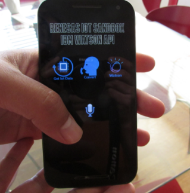

## Mobile App to Use IBM Watson API with Renesas IoT Sandbox Data Monitoring

Quick and easy way to build a mobile app that adds voice to your IoT project during the proof of concept phase. This shows a very fast way to use Python and cloud-based APIs to present a concept to your peers or boss to get approval to build prototype. 
 
For simplicity and speed of development, I’ll show you how to build a mobile application entirely in Python, which is very popular for data analysis. Python is also the language used in Renesas IoT Sandbox Data Intelligence workflows.
 
Python is not as popular as JavaScript and Cordova for mobile app prototyping. I chose Python for my project because it is more popular for IoT data analytics and fits in nicely with the overall ecosystem for the Renesas IoT Sandbox.
 
My previous article, Using Speech in Your IoT Projects, showed the use of bash and Python scripts from the command line to connect to the Renesas IoT Sandbox Data Monitoring API and then send the data to the IBM Watson API.
